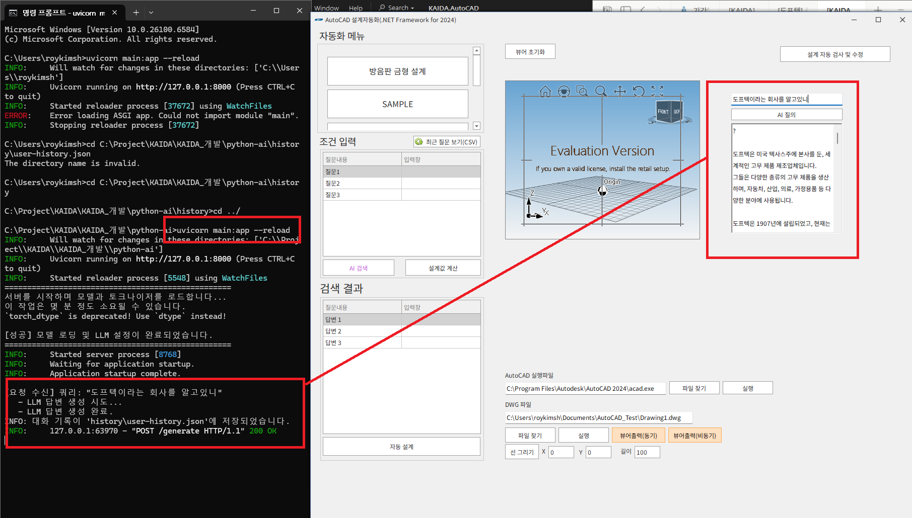

# mentoring-history

# 1차 멘토링

1순위 : frontend

2순위 : backend

3순위 : app

저의 메인 기술 stack

- python, js, typescript
    - back : fastapi, node js
- llm orchestration → Agent 개발
    - langchain, langgraph

필요로 하는 기술 stack

- 회사 : C#, 시스템 프로그래밍
- 학업 : 인공지능

⇒ 1. 멘토 : C#, 시스템 프로그래밍 > 질답

**`⇒ 2. 저랑 같이 사이드 프로젝트를 진행 → RAG, Web-search Agent 하나 만들기`**

: 3회

**Agent**

→ Input : 사람의 질문

→ middle : LLM이 사람 질문에 맞는 tool을 알아서 선택하고 호출하여 input에 맞는 답변을 생성

→ output : 답변 혹은 이미지

**Side Project**

**언어** : python

- **fastapi** : api wrapping
- **stt** : model 찾아 봐야 함 (speech - to - text)
- **llm**
    - **sass** : openai, **`gemini` ← 하루 1000건 무료**
    - **opensource** : gemma3, qwen3
        - model을 serving을 해야하는데, gpu가 혹시 있으신지..
            - mac : ollama [https://ollama.com/](https://ollama.com/)
            - 모델을 local에 받아서 사용 ← hw spec (gpu 혹은 Mac의 경우 통합메모리가 커야합니다.)
- **orchestrator** : langchain, langgraph
    - LLM Pipeline
        - [https://www.langchain.com/](https://www.langchain.com/)
    - **`STT 회의록 요약`**  → `TTS로 읽어주기`
        - audio(stt) + system prompt(어떤 행동을 해야하는 지를 정의하는 프롬프트 : audio 회의 내용을 요약해줘) → audio를 map-reduce (문장이 길때 → split하고 각자 요약해서 → merge)
    - **text2sql**
        - (sql 모르는 대상자들) 자연어 질의 → llm이 자연어를 sql로 컨버팅 → db 조회(RDB) → python _repl(numpy, matplotlib) → visualization → front로 전달
    - **Vector DB  →  RAG**
        - 저장 : 자연어를 vector로 embedding(AI모델) : string → vector (숫자 벡터 [[0.1, 0.11, 0.0], [0.2, 0.5, 0.4], […] …] 
        image → **vector ← 인공지능이 이해하는 것은 vector**
        text → **vector**
        - 검색 : vector (cosine similarity) 두 벡터를 가지고 내적해서 유사도를 계산 → 유사도 높은 문서(text)를 검색

(backend) langchain/langgraph 기반의 orchestrating + fastapi → restful api

[https://wikidocs.net/253712](https://wikidocs.net/253712)

12장 까지 보기

일정

- 1차 멘토링 : 학습 (orchestrator)
- 2차 멘토링 : orchestrator + **fastapi (9/7)**
- 3차 멘토링 : orchestrator(**+ stt)** + **fastapi**

Orchestrator : 내부적으로 수행되는 llm 프로그램

RDB → sql schema알고 있다고 가정하고 db에서 데이터를 조회하는데

인프런 : 사이드 프로젝트 기반

- langchain - https://www.inflearn.com/course/rag-llm-application%EA%B0%9C%EB%B0%9C-langchain
- db - https://www.inflearn.com/course/5%EC%B2%9C%EC%96%B5%EA%B1%B4%EC%9D%B4-%EB%84%98%EB%8A%94-%EA%B8%88%EC%9C%B5-%EB%8D%B0%EC%9D%B4%ED%84%B0%EB%A5%BC-%EC%B2%98%EB%A6%AC%ED%95%98

architecture (backend)

→ preprocessing → audio → stt → text

→ Input : audio 회의 내용

→ middle : orchestrating (llm pipeline)

- audio + system prompt(어떤 행동을 해야하는 지를 정의하는 프롬프트 : audio 회의 내용을 요약해줘) → audio를 map-reduce (문장이 길때 → split하고 각자 요약해서 → merge) : agent

→ output : 요약된 회의록 정보

# 2차 멘토링

> 히스토리
> 
> - (성훈 25.09.24)
> 회사에서 언어모델 서버 만들어야하는 일이 생겨서 
> `FastAPI` + `huggingface` + `gemma3`로 C# 윈폼과 연결해보았는데 생각보다 쉽게 성공했습니다. 기쁜 마음에 공유합니다.
> 
> 
> 

Gemini → 하루에 1000건 call까진 무료

**`STT 회의록 요약`**

구현안 1.

**→ 회의시 녹음기 켜고, mp4 생성 → mp4 stt** → LLM → output

1. **STT** : **Openai Whisper, Google Speech-to-Text**
2. **LLM** : **Openai GPT, Google Gemini** 
3. **FastAPI** :  Input : file(mp4) / Output : text(summary)

전체적인 맥락은 알아서 잘 해주긴 함.

디테일 한 것이 더 필요하다면? 

STT → LLM(교정) → LLM(요약)

1. STT → Text → LLM : langchain 필요 x
2. STT → Text(엄청 긴 text) → 토큰 리밋에 따라 분리(각각을 배치로 요약) → 최종 요약 : langchain 필요

LCEL → llm(openai, claude, gemini) → output형식, 메서드가 다 다른데, langchain을 쓰면 공통된 method로 인터페이스 매핑

Ollama → LLM모델을 cpp 기반으로 로컬에서 실행하게 만들어주는 프로그램

API로 LLM 호출 → 서비스레벨에서 (open안된 모델) LLM 호출

직접 모델을 다운받아서 LLM 호출 → open source LLM 모델

python → huggingface → 모델 다운 → 토크나이저 설정 → 셋업의 시간

**`ollama → 딸깍`**

~~구현안 2.~~

**~~→ 회의시 RealTimeSTT → Text append** → LLM → output~~

다음 일정 : 9월 28일

# 3차 멘토링

### Prompt (Gemma 제외한 대부분의 모델)

- System Prompt
    - LLM에게 전역적으로 강제하는 프롬프트
- Human Prompt
    - (개념적으로) System Prompt를 상속받아서, 추가적인 요구사항을 요청하는 느낌

```python
System_Prompt = """
너는 CAD 질의에 대한 답변을 주는 Assistant야.

답변을 수행할 때는 한국어로 해줘.
참고문서가 들어오는 경우에는 이를 한번 요약해주고 답변해줘.
...
"""

Human_Prompt = """
[참고문서]
{Document}

답변 : 
"""
```

기본적인 챗봇에서는 세션별로 멀티턴 대화를 저장하고 있음.

→ 따라서, 해당 세션에 대해서는 대화 로그를 기억할 수 있음. (토큰수에 따라서 기억할 수 있는 턴 수는 달라진다.)

```python
session_1 = {
	{
		"turn1": uuid
		"conversation": {
			"system" : "...",
			"user" : "..."
		}
	},
	{
		"turn2": uuid
		"conversation": {
			"system" : "...",
			"user" : "..."
		}
	},
		"turn2": uuid
		"conversation": {
			"system" : "...",
			"user" : "..."
		}
	}
}
```

어떤 유저별 스타일 셋업, 

**Long-term Memory (User 별 DB 셋업 후 프롬프트나 답변 스타일 저장)**

```python
System_Prompt = """
...
기본적인 system prompt
...
[user defined system prompt]
{system_prompt}
"""
```

### Chatbot UI - Prototyping

https://streamlit.io/

https://www.gradio.app/

### Model Serving (vLLM)

- Model이 답변을 생성하기 위해서는 Matrix Multiplication 연산이 들어간다. → O(n*2) ~ O(n*3)
    - 엄청나게 Computational Cost가 많이 소비되는 연산 
    → 답변이 길어질 수록 답변의 속도는 점점 느려짐.
- 이를 해결하기 위해서 KV-Caching을 활용을 한다. → 연산이 많이 줄어든다.
- 하지만, KV-Caching을 할 때 실제 메모리 공간을 미리 점유해야하기 때문에 메모리 관리가 어려움.
- 메모리 공간을 효율적으로 관리하기 위해서 Paging 기법을 적용 (System Prompt 처리도 용이)
 ⇒ `vLLM`

### ML에서 왜 GPU를 써야 성능이 좋을까?

- ML 단일 성능보다는 **병렬 성능**이 더 중요해요.
    - Tensor라는 **행렬 연산**으로 프로세스가 수행된다.
- `CPU` : 하나의 작업을 정말 잘하는 똑똑한 아이
- `GPU` : 하나의 작업을 그렇게까지는 잘하진 못하지만 병렬로 처리를 잘하는 아이


AI 관련 직무

- **`AI Engineer (모델-백엔드)`**
    - LLM side에서는, Parsing, chunking, embedding, orchestration, .. (다 합니다.)
- Data Scientist : 모델 만드는 사람
- Data Analyst : 데이터 분석으로 인사이트 추출하는 사람
- **`MLOps Engineer : DevOps / MLOps 모델, 데이터 운영관리 (백엔드-인프라)`**

# 프로젝트 배포

최근 회사에서 업무하면서 claude code를 정말 감탄하면서 사용하고 있습니다.

Claude code와 포트폴리오에 있는 프로젝트를 전체적으로 개선해서 ms 스토어와 웹 배포를 해야겠다는 생각이 요즘 드네요.. 
아무튼 AI의 많은 도움을 받아서 허깅페이스에 부족하지만 첫걸음이라는 의의를 두고 배포 링크를 공유합니다.

AI에 대해 무지했는데 첫 시작을 할 수 있게된 것에 감사했습니다. ^^

[huggingface.co](https://huggingface.co/spaces/AmoryKim/minutesAI)